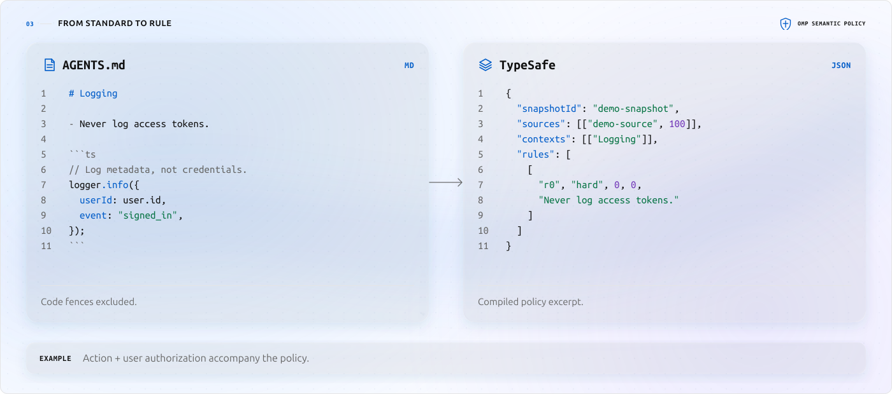
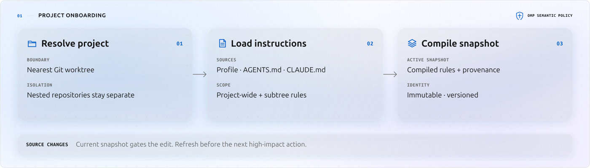
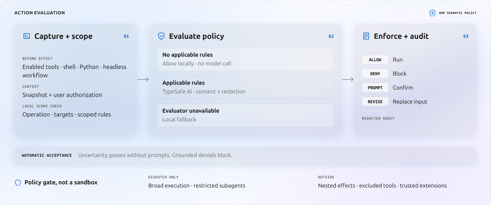

#  OMP Semantic Policy

An [Oh My Pi (OMP)](https://github.com/can1357/oh-my-pi) plugin that checks agent actions against your project instructions and authorization. [TypeSafe AI](https://typesafe.ai/) provides semantic evaluation when remote checks are enabled.

<picture>
  <source media="(prefers-color-scheme: dark)" srcset="docs/assets/policy-flow/policy-compilation-dark.svg">
  <source media="(prefers-color-scheme: light)" srcset="docs/assets/policy-flow/policy-compilation-light.svg">
  
</picture>

## How it works

### Project onboarding

<picture>
  <source media="(prefers-color-scheme: dark)" srcset="docs/assets/policy-flow/policy-onboarding-dark.svg">
  <source media="(prefers-color-scheme: light)" srcset="docs/assets/policy-flow/policy-onboarding-light.svg">
  
</picture>

### Action evaluation

<picture>
  <source media="(prefers-color-scheme: dark)" srcset="docs/assets/policy-flow/policy-evaluation-dark.svg">
  <source media="(prefers-color-scheme: light)" srcset="docs/assets/policy-flow/policy-evaluation-light.svg">
  
</picture>

**A policy gate, not a sandbox.** Uncertainty is automatically accepted; grounded denials block.

## Get started

Requires [OMP](https://github.com/can1357/oh-my-pi) 18.1.19 or newer. Remote evaluation also requires a [TypeSafe AI](https://typesafe.ai/) token and explicit consent.

Add the marketplace and install the plugin:

```bash
omp plugin marketplace add goulinkh/omp-semantic-policy
omp plugin install omp-semantic-policy@goulinkh
```

Restart [OMP](https://github.com/can1357/oh-my-pi) inside a Git worktree, then:

```text
/login typesafe-ai
/policy consent on
/policy status
```

Projects onboard automatically. Use `TYPESAFE_API_KEY` instead of `/login` if preferred. Without credentials or consent, local checks and configured fallback remain active.

## Upgrade

Refresh the marketplace catalog before upgrading the installed plugin:

```bash
omp plugin marketplace update goulinkh
omp plugin upgrade omp-semantic-policy@goulinkh
```

The package, marketplace catalog, and prepared release tag use version `0.1.0` ([`v0.1.0`](https://github.com/goulinkh/omp-semantic-policy/releases/tag/v0.1.0)).

## Commands

### Inspect policy

- `/policy status`: Show the active snapshot and evaluator state.
- `/policy coverage`: Inspect runtime enforcement coverage.
- `/policy review`: Review the compiled rules.
- `/policy audit [1–100]`: Inspect recent redacted decisions and evidence.

### Refresh and maintenance

- `/policy onboard`: Refresh the project's policy snapshot.
- `/policy link @<file-or-directory>`: Add a persistent project-wide policy source. Relative paths resolve from the project working directory; linked directories recursively load `.adoc`, `.md`, `.markdown`, `.mdx`, `.prompt`, `.rst`, `.rules`, and `.txt` files. The canonical link is stored for the current Git project and reloaded in future sessions.
- `/policy maintenance`: Review an uncertain maintenance proposal.
- `/policy maintenance approve <action-id>`: Approve one exact maintenance retry.
- `/policy maintenance revoke`: Clear the maintenance approval.

Maintenance approval applies to one exact retry, not blanket authorization.

### Remote evaluation

- `/policy consent on` / `/policy consent off`: Enable or disable remote evaluation.
- `/logout typesafe-ai`: Remove the stored credential.

## Configuration

### Status and feedback

- `showStatus` (default: `true`): Show policy state in the status bar.
- `showViolationFeedback` (default: `true`): Show direct-action and headless workflow outcome notifications. Tool denials stay attached to their own result cards; confirmation dialogs identify the exact action.

### Confirmation

- `confirmationDefault` (default: `approve`): Automatically accept confirmation requests, including ungrounded model denials and unavailable-evaluator fallbacks. Set `deny` for fail-closed automatic resolution. Grounded policy denials remain blocked.
- `confirmationThreshold` (default: `1`): Automatic mode, without dialogs, including headless sessions. Set below `1` to enable interactive confirmation at or above that confidence; `0` prompts for every uncertain checked action. Explicitly enabled prompts deny without an interactive UI.

Interactive sessions skip post-response workflow evaluation entirely so extension work cannot race or consume the next draft's first keystroke. Headless session-stop checks remain automatic and use `confirmationDefault`.

The model's allow-confidence cutoff is **50%**, while deny confidence requires **80%**. A hard-violation probability of **80%** can also trigger denial, but **every semantic denial requires a matched applicable rule**. Citation-choice confidence of **65%** establishes attribution directly. If an otherwise blocking assessment selects a known rule below that cutoff, one additional check can establish that specific violation at **80%** probability; competing valid citations need not concentrate on one choice. No selected rule, failed verification, or unresolved evidence does not establish a violation. Automatic mode deliberately accepts uncertainty, not compliance. Deterministic local protections and incomplete-action guards remain blocking. Existing explicit settings are preserved.

Blocked tool cards separate the action, readable rule, source file, and next step. Prohibitions retain their `Don't` meaning. IDs, probability scores, full provenance, and confirmation diagnostics remain in `/policy audit`, not the compact card. Execution feedback includes the working directory and environment override names, never their values. If a source is incorrectly scoped, correct it and run `/policy onboard`; a different tool is not an approval workaround.

Remote mutation checks include proposed content, bounded original source, and explicit before/after hunks for supported edits. The hunks describe proposed changes, not executed results. Stale anchors, unsupported operations, missing files, and omitted evidence are marked unavailable or partial rather than guessed. Inspection respects local read prohibitions and canonical project boundaries.

Shell checks also include bounded recent user text and the preceding assistant proposal, so a short confirmation or refusal retains its subject. Assistant text is not permission; conversational approval never overrides an absolute prohibition. Recognized credentials are redacted, but arbitrary sensitive text may remain. Automatic acceptance of uncertainty is unchanged: better evidence does not guarantee detection.

### Remote tool coverage

- `enabledToolCalls`: A comma-separated allowlist of exact tool names for remote evaluation. An empty value selects all tool calls.

  Default: `bash,eval,python,write,edit,task,hub,browser,computer,debug`.

- `disabledToolCalls` (default: empty): A comma-separated list of exact tool names to exclude from semantic evaluation. Takes precedence over `enabledToolCalls`; excluded unknown tools are not rejected for lacking a built-in adapter.

- `toolOperations` (default: empty): Classify custom or MCP tools with comma-separated `name=operation` entries, for example `launchpad=read,launchpad_write=execute`. Supported operations are `read`, `write`, `execute`, `delegate`, `network`, `workflow`, `internal`, and `unknown`. JSON object syntax is also accepted. Built-in classifications cannot be overridden.

Coverage filters do not bypass grounded local path protections. Completeness checks apply to semantically covered calls; an enabled but unclassified custom tool fails closed. Direct shell, Python, and headless workflow gates remain independent.

## Coverage limits

- Host hooks gate tool calls. Broad execution and restricted subagents are dispatch-only; session-stop workflow enforcement is headless-only because interactive post-response hooks race the next draft.
- Nested effects, utility commands, and trusted extensions are not contained.
- Local path checks cover a narrow literal-path grammar, not all prose, filesystem races, or unseen LSP effects.

See [Architecture](docs/architecture.md) for scope, authorization, fallback, and maintenance guarantees and [OMP integration](docs/findings/omp-integration.md) for host boundaries.

## Project documentation

[Development](docs/development.md) · [Roadmap](docs/roadmap.md) · [Design decisions](docs/decisions.md)
